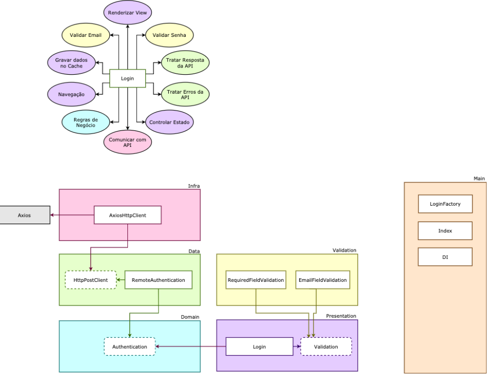

# CLEAN ARCHITECTURE

 

  

 

# CAMADAS

 

- #### DOMAIN: onde fica as regras de negócios da aplicação.

Cria apenas interfaces para serem implementadas. O ideal é que o domain não depende de nada.

Ex.: Criou a interface Authentication com o método auth que recebe um email e uma password, retornando um accessToken.

 

- #### DATA: onde fica as implementações dos casos de uso do domain.

Implementa as interfaces do domain.

Ex.: a classe RemoteAuthentication implementou a interface Authentication tratando a resposta da API e os seus erros. Também recebe a interface httpPostClient para fazer a requisição post.

 

- #### INFRA: onde fica as implementações que normalmente usam frameworks externos

Faz a comunicação com a API

Ex.: a classe AxiosHttpClient implementa a interface HttpPostClient, usando o axios para fazer a requisição post.

 

- #### PRESENTATION: onde ficam as IUs e o tratamento de conversão de dados(transformar um date em um dado formatado, por exemplo)

Faz a renderização da view, controle de estado, navegação e gravar dados no cache

Ex.: o componente Login depende apenas das interfaces authentication e validation

 

- #### VALIDATION: faz as validações do formulário

Faz a validação da senha e do email

Ex.: requiredFieldValidation e emailFieldValidation

 

- #### MAIN: Depende de todas as camadas

Vão ter factories, ou seja, classes que retornam instâncias de outras classes.

 

### IMPORTANTE!!

Quando quisermos desacoplar uma camada, criamos uma interface para ela e fazemos ela implementá-la. Assim, fica dependendo apenas de uma abstração e não de uma implementação.
